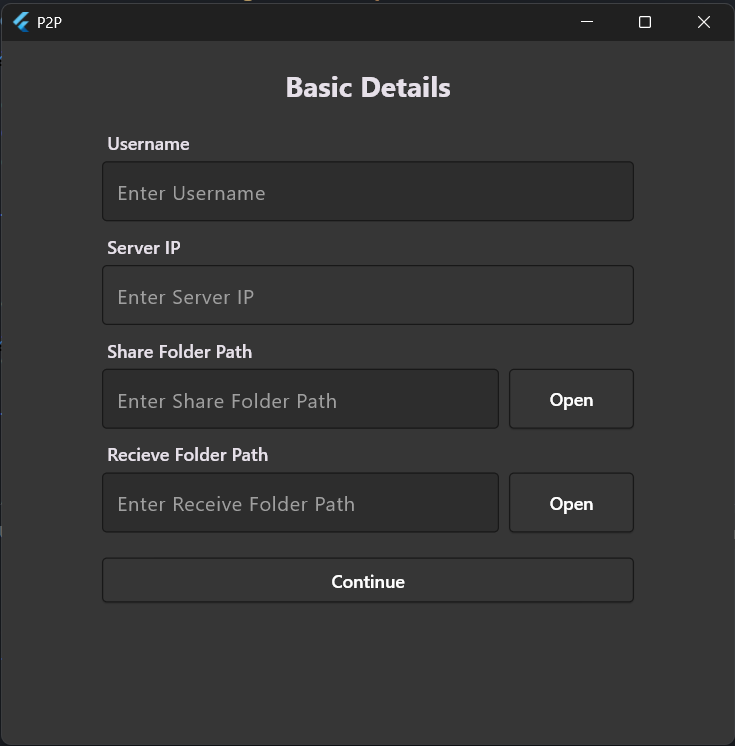
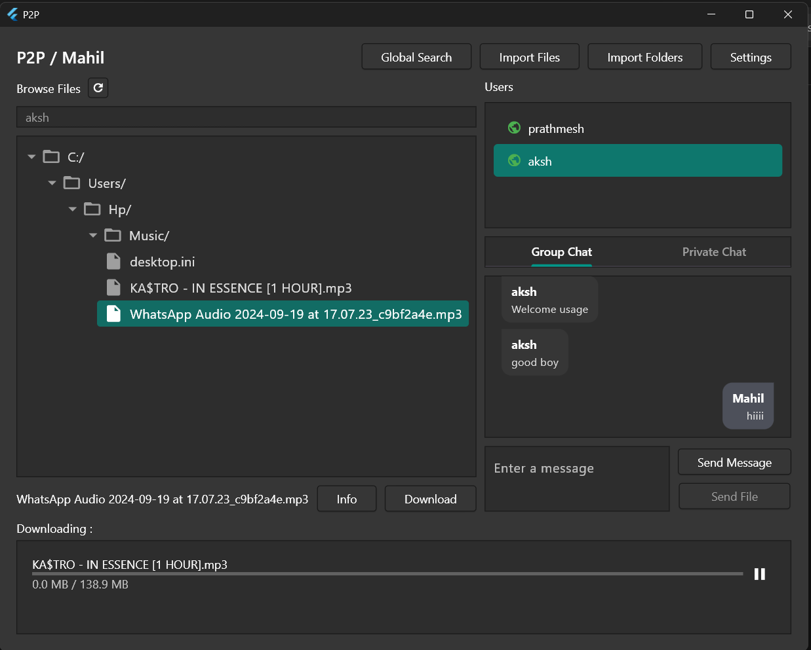
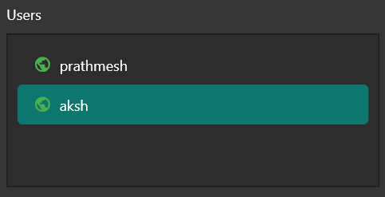
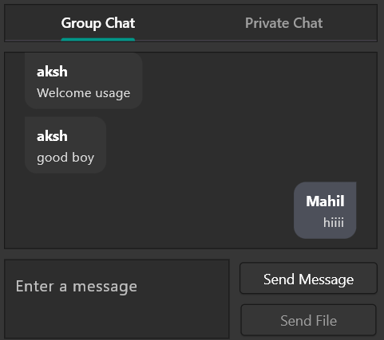
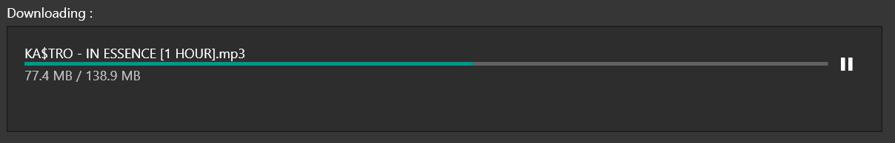
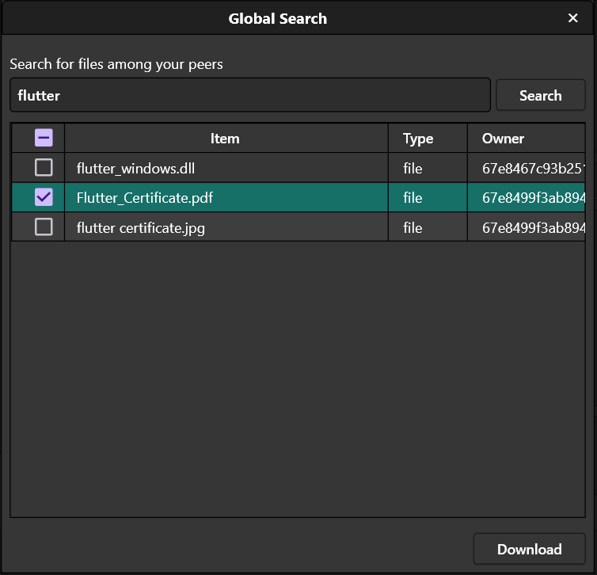
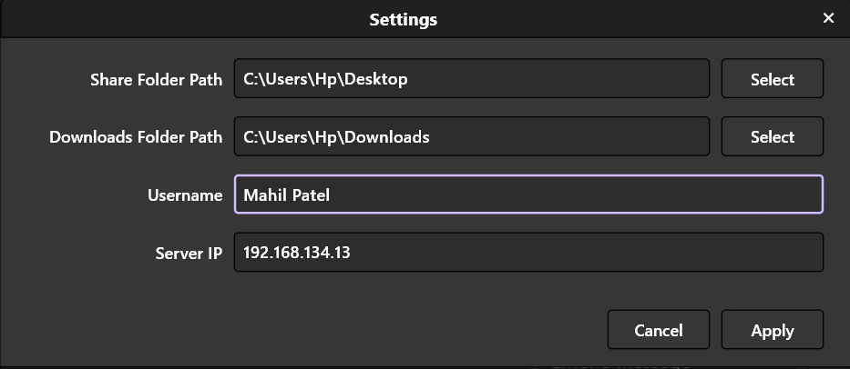

# 📦 EchoBox - P2P File Sharing & Messaging App

**EchoBox** is a high-speed, real-time, peer-to-peer (P2P) file transfer and messaging platform built with a Node.js backend and a Flutter frontend. It enables seamless file sharing, group chat, direct messages, and real-time communication over WebSockets and Socket.IO — all in a clean and intuitive UI.

---

## ✨ Features

- 🔍 **File Search:** Easily discover files shared by peers.
- 👥 **Online Users:** See who’s online and ready to connect.
- 📁 **File Sharing:** Send and receive files over WebSockets with progress tracking.
- 💬 **Group Messaging:** Stay connected with all users in real time.
- 📩 **Direct Messaging:** Private chats with selected users.
- 📊 **Download Progress Bar:** Track file download status visually.

---

## 🧠 Architecture

The project is split into two components:

### 🖥️ Server (Node.js + Express)
- Real-time communication via **Socket.IO**
- File transfers via **WebSockets**
- Manages user sessions and broadcasts

### 📱 Client (Flutter)
- UI for messaging, file browsing, and download tracking
- Interacts with the backend in real-time
- Handles group and direct messaging

---

## 🛠️ Installation

### Prerequisites

- Node.js (v18+)
- Flutter SDK (3.10+ recommended)
- Git

---

## 🚀 Getting Started

### 1. Clone the Repository

```bash
git clone https://github.com/your-username/EchoBox.git
cd EchoBox
```

### 2. Server Setup

```bash
cd server
npm install
npm start
```

> The server will start on `http://localhost:3000` by default.

### 3. Flutter Client Setup

```bash
cd flutter_client
flutter pub get
flutter run
```

> Make sure a device/emulator is running.

---

## 🖼️ GUI Preview

### Register Window


### Main Window


### Online Users


### 💬 Chat Interface


### 📥 Progress Bar


### 🔍 Global Search


### Change User Settings



---

## 🔧 Configuration

- Modify the server port or WebSocket configurations in `server/index.js`
- Update client API/WebSocket URLs in the Flutter `constants.dart` (or equivalent config file)

---

## 🧪 Testing

You can simulate multiple users on different devices/emulators or browser tabs to test real-time messaging and file transfer.

---

## 🤝 Contributing

Pull requests are welcome. For major changes, please open an issue first to discuss what you would like to change.

---

## 📬 Contact

For queries or feedback, feel free to reach out at [dhingraaksh.email@example.com]
